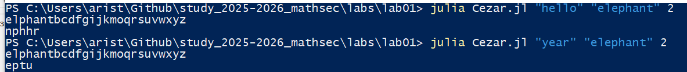

---
## Front matter
title: "Отчёт по лабораторной работе 1"
subtitle: "Шифры простой замены"
author: "Аристова Арина Олеговна"

## Generic otions
lang: ru-RU
toc-title: "Содержание"

## Bibliography
bibliography: bib/cite.bib
csl: pandoc/csl/gost-r-7-0-5-2008-numeric.csl

## Pdf output format
toc: true # Table of contents
toc-depth: 2
lof: true # List of figures
fontsize: 12pt
linestretch: 1.5
papersize: a4
documentclass: scrreprt
## I18n polyglossia
polyglossia-lang:
  name: russian
  options:
	- spelling=modern
	- babelshorthands=true
polyglossia-otherlangs:
  name: english
## I18n babel
babel-lang: russian
babel-otherlangs: english
## Fonts
mainfont: PT Serif
romanfont: PT Serif
sansfont: PT Sans
monofont: PT Mono
mainfontoptions: Ligatures=TeX
romanfontoptions: Ligatures=TeX
sansfontoptions: Ligatures=TeX,Scale=MatchLowercase
monofontoptions: Scale=MatchLowercase,Scale=0.9
## Biblatex
biblatex: true
biblio-style: "gost-numeric"
biblatexoptions:
  - parentracker=true
  - backend=biber
  - hyperref=auto
  - language=auto
  - autolang=other*
  - citestyle=gost-numeric
## Pandoc-crossref LaTeX customization
figureTitle: "Рис."
listingTitle: "Листинг"
lofTitle: "Список иллюстраций"
lolTitle: "Листинги"
## Misc options
indent: true
header-includes:
  - \usepackage{indentfirst}
  - \usepackage{float} # keep figures where there are in the text
  - \floatplacement{figure}{H} # keep figures where there are in the text
---


# Цель работы

Изучить шифрование простой заменой, в частности шифры Цезаря и Атбаш.

# Задание

- Реализовать шифр Цезаря с произвольным ключом k

- Реализовать шифр Атбаш

# Выполнение лабораторной работы

## Код шифрования шифром Цезаря 

Программа принимает сообщение, которое необходимо закодировать, ключевое слово и размер сдвига.

Код создает алфавит, в котором сначала ключевое слово, затем остальные символы алфавита в алфавитном порядке, и осуществляет необходимый сдвиг:


```p
msg = ARGS[1]
key_word = ARGS[2]
key_num = parse(Int, ARGS[3])

function encrypt()
    result = ""
    alph = ""
    for c in key_word
    	if !(c in alph)
	    alph = alph * c
	end 
    end
    	
    first_char = msg[1]
    if first_char in "абвгдеёжзийклмнопрстуфхцчшщьыъэюя"
	for i in "абвгдеёжзийклмнопрстуфхцчшщьыъэюя"
	    if !(i in alph)
		alph = alph * i
	    end
	end
    else 
	for i in "abcdefghijklmnopqrstuvwxyz"
	    if !(i in alph)
		alph = alph * i
	    end
	end
    end
    println(alph)
    
    alph_vec = collect(alph)   # преобразуем строку в массив символов для русского 
    for char in msg
	ind = findfirst(char, alph)
	result = result * alph_vec[(ind + key_num - 1) % length(alph_vec) + 1]
    end 
    result
end 
a = encrypt()
println(a)	
```

## Проверка работы кода

Проверяю работу кода, получаю результат, идентичный тому, что был получен мною в результате шифрования вручную:

{#fig:001 width=90%}

## Реализация шифра Атбаш

Данная программа принимает на вход сообщение для шифрования и алфавит, переворачивает алфавит и задает результат шифрования теми же индексами 

```p

msg = ARGS[1]
alph = ARGS[2]
rev = reverse(alph)

function atbash()
    result = ""
    for c in msg
        result = result * rev[findfirst(c, alph)]
    end 
    result
end

a = atbash()

println(a)

```

## Проверка работы кода Атбаш

Проверяю работу кода, получаю результат, идентичный тому, что был получен мною в результате шифрования вручную:

{#fig:002 width=90%}

## Вывод

В ходе выполнения данной лабораторной работы мною были получены знания о шифрах простой замены, а также навыки по реализации шифрования простой заменой, а именно шифрами Цезаря и Атбаш.

# Список литературы{.unnumbered}

- Описание лабораторной работы 
