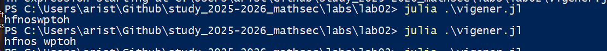

---
## Front matter
title: "Отчёт по лабораторной работе 2"
subtitle: "Шифры перестановки"
author: "Аристова Арина Олеговна"

## Generic otions
lang: ru-RU
toc-title: "Содержание"

## Bibliography
bibliography: bib/cite.bib
csl: pandoc/csl/gost-r-7-0-5-2008-numeric.csl

## Pdf output format
toc: true # Table of contents
toc-depth: 2
lof: true # List of figures
fontsize: 12pt
linestretch: 1.5
papersize: a4
documentclass: scrreprt
## I18n polyglossia
polyglossia-lang:
  name: russian
  options:
	- spelling=modern
	- babelshorthands=true
polyglossia-otherlangs:
  name: english
## I18n babel
babel-lang: russian
babel-otherlangs: english
## Fonts
mainfont: PT Serif
romanfont: PT Serif
sansfont: PT Sans
monofont: PT Mono
mainfontoptions: Ligatures=TeX
romanfontoptions: Ligatures=TeX
sansfontoptions: Ligatures=TeX,Scale=MatchLowercase
monofontoptions: Scale=MatchLowercase,Scale=0.9
## Biblatex
biblatex: true
biblio-style: "gost-numeric"
biblatexoptions:
  - parentracker=true
  - backend=biber
  - hyperref=auto
  - language=auto
  - autolang=other*
  - citestyle=gost-numeric
## Pandoc-crossref LaTeX customization
figureTitle: "Рис."
listingTitle: "Листинг"
lofTitle: "Список иллюстраций"
lolTitle: "Листинги"
## Misc options
indent: true
header-includes:
  - \usepackage{indentfirst}
  - \usepackage{float} # keep figures where there are in the text
  - \floatplacement{figure}{H} # keep figures where there are in the text
---


# Цель работы

Изучить шифры перестановки, в частности шифр Виженера, маршрутную перестановку, шиврование с помощью решеток.

# Задание

Реализовать несколько шифров перестановки:

- Шифр Виженера

- Шифр маршрутной перестановки

- Шифр с помощью решеток

# Выполнение лабораторной работы

## Код шифрования шифром Виженера 

Шифрование перестановками - символы исходного текста переставляются местами по определенному алгоритму.

Шифр Виженера - полиалфавитный шифр, где для шифрования используется ключевое слово, сдвигающее буквы сообщения.


```
function vigener_encrypt(msg, key)
    alph = 'a':'z'
    result = ""
    key_index = 1

    for i in msg
        if isletter(i)
            shift = findfirst(isequal(key[key_index]),  alph) - 1
            index = findfirst(isequal(i), alph) + shift
            if index > 26
                index = index - 26
            end
            result = result * alph[index]
            key_index = key_index + 1
            if key_index > length(key)
                key_index = 1
            end 
        #= else 
            result = result * i
        =#
        end 
    end 
    result
end 

msg = "hello world"
key = "abcde"
println(vigener_encrypt(msg, key))
```

## Проверка работы кода

Проверяю работу кода, получаю результат, идентичный тому, что был получен мною в результате шифрования вручную:

{#fig:001 width=90%}

## Реализация шифра маршрутной перестановки 

Шифр маршрутной перестановки - текст записывается в таблицу по одному маршруту, а считывается по-другому (зигзагом, по спирали и т.д.).

```
function route_encrypt(msg, key, rows, cols)
    msg = filter(!isspace, msg)
    matrix = fill('_', rows, cols)
    index = 1
    result = ""
    for i = 1:rows
        for j = 1:cols
            if index != rows*cols
                matrix[i,j] = msg[index]
                index = index + 1
            end
        end
    end
    
    for j in sort(collect(key))
        for i = 1:rows
            result = result * (matrix[i, findfirst(j, key)])
        end 
    end
    result
end 

msg = "hello world hello"
rows = 3
cols = 5
key = "abcde"
println(route_encrypt(msg, key, rows, cols))
```

## Проверка работы кода маршрутной перестановки

Проверяю работу кода, получаю результат, идентичный тому, что был получен мною в результате шифрования вручную:

{#fig:002 width=90%}

## Реализация шифра с помощью решеток

Шифрование с помощью решеток - использование физической решетки с отверстиями для записи/чтения символов в определенном порядке.

```
function rails_encrypt(msg, key, k)
        grid = fill(" ", 2 * k, 2 * k)
        matrix = fill(" ", k, k)
        index = 1
        result = ""
        msg = replace(msg, " " => "")
        for i in 1:k
                for j in 1:k
                        grid[i, j] = string(index)
                        matrix[i, j] = string(index)
                        index += 1
                end
        end
        for i = 1:(size(grid)[1])
                for j = (size(grid)[1]):-1:1
                        if grid[i, j] == " "
                                matrix = rotr90(matrix)
                                grid[(i+k-1):-1:i, j:-1:(j-k+1)] = matrix[k:-1:1, k:-1:1]
                        end
                end
        end

        index = 1
        arr = Vector{String}()

        for r in msg
                checker = false
                for i = 1:(size(grid)[1])
                        for j = 1:(size(grid)[2])
                                if grid[i, j] == string(index) && checker == false
                                        if ((string(i + 1, " ", j) ∉ arr) && (string(i - 1, " ", j) ∉ arr) && (string(i, " ", j - 1) ∉ arr) && (string(i, " ", j + 1) ∉ arr))
                                                grid[i, j] = string(r)
                                                push!(arr, string(i, " ", j))
                                                checker = true
                                        end
                                end
                        end
                        if checker == true
                                index = index + 1
                                if index > k^2
                                        index = 1
                                        empty!(arr)
                                end
                                break
                        end
                end
        end

        for j in sort(collect(key))
                for i = 1:2k
                        result = result * (grid[i, (findfirst(j, key))])
                        if tryparse(Float64, string(last(result))) != nothing
                                result = replace(result, last(result) => ' ')
                        end
                end
        end
        return result

end

msg = "hello world"
key = "keys"
k = 2
res = replace(rails_encrypt(msg, key, k), " " => "")
println(res)
```

## Проверка работы кода шифра с помощью решеток

Проверяю работу кода, получаю результат, идентичный тому, что был получен мною в результате шифрования вручную:

{#fig:003 width=90%}

## Вывод

В ходе выполнения лабораторной работы мною были реализованы программные решения шифрования с помощью шифров Виженера, маршрутной перестановки, перестановки с помощью решеток

# Список литературы{.unnumbered}

- Описание лабораторной работы 
