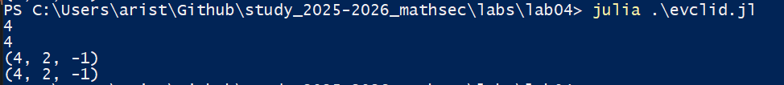

---
## Front matter
title: "Отчёт по лабораторной работе 4"
subtitle: "Вычисление наибольшего общего делителя"
author: "Аристова Арина Олеговна"

## Generic otions
lang: ru-RU
toc-title: "Содержание"

## Bibliography
bibliography: bib/cite.bib
csl: pandoc/csl/gost-r-7-0-5-2008-numeric.csl

## Pdf output format
toc: true # Table of contents
toc-depth: 2
lof: true # List of figures
fontsize: 12pt
linestretch: 1.5
papersize: a4
documentclass: scrreprt
## I18n polyglossia
polyglossia-lang:
  name: russian
  options:
	- spelling=modern
	- babelshorthands=true
polyglossia-otherlangs:
  name: english
## I18n babel
babel-lang: russian
babel-otherlangs: english
## Fonts
mainfont: PT Serif
romanfont: PT Serif
sansfont: PT Sans
monofont: PT Mono
mainfontoptions: Ligatures=TeX
romanfontoptions: Ligatures=TeX
sansfontoptions: Ligatures=TeX,Scale=MatchLowercase
monofontoptions: Scale=MatchLowercase,Scale=0.9
## Biblatex
biblatex: true
biblio-style: "gost-numeric"
biblatexoptions:
  - parentracker=true
  - backend=biber
  - hyperref=auto
  - language=auto
  - autolang=other*
  - citestyle=gost-numeric
## Pandoc-crossref LaTeX customization
figureTitle: "Рис."
listingTitle: "Листинг"
lofTitle: "Список иллюстраций"
lolTitle: "Листинги"
## Misc options
indent: true
header-includes:
  - \usepackage{indentfirst}
  - \usepackage{float} # keep figures where there are in the text
  - \floatplacement{figure}{H} # keep figures where there are in the text
---


# Цель работы

Изучить алгоритм Евклида для нахождения НОД (наибольшего общего делителя), бинарный алгоритм Евклида, а также расширенные их версии, которые находят также коэффициенты соотношения Безу: НОД $= x * a + y * b$, где a, b - рассматриваемые числа

# Задание

Реализовать программный код для: 

- алгоритма Евклида

- бинарного алгоритма Евклида

- расширенного алгоритма Евклида

- расширенного бинарного алгоритма Евклида

# Выполнение лабораторной работы

## Решение задачи. Алгоритм Евклида

Последовательно заменяем числа $(a, b)$ на *(b, a % b)* до тех пор, пока $b ≠ 0$.  
Последнее ненулевое число — это НОД.

```
# Базовый алгоритм
function evclid(a::Int, b::Int)
    while b != 0
        a, b = b, a % b
    end
    return abs(a)
end 
```


## Решение задачи. Бинарный алгоритм Евклида 

Использует только побитовые сдвиги и вычитания. Общие степени двойки выносятся отдельно.

```
function bin_evclid(a::Int, b::Int)
    if a == 0 
        return abs(b) 
    end
    if b == 0 
        return abs(a)
    end
    shift = 0
    while iseven(a) && iseven(b)
        a >>= 1 
        b >>= 1
        shift += 1
    end
    while a != b
        if iseven(a)
            a >>= 1
        elseif iseven(b)
            b >>= 1
        elseif a > b
            a = a - b
        else
            b = b - a
        end 
    end
    return a << shift 
end 
```


## Решение задачи. Расширенный алгоритм Евклида

Классический алгоритм, дополненный тем, что находит также числа $x$ и $y$, такие что выполняется линейная комбинация:
$ НОД(a,b)=a*x+b*y$

```
function extended_evclid(a::Int, b::Int)
    old_r, r = a, b
    old_x, x = 1, 0
    old_y, y = 0, 1
    while r != 0
        quotient = div(old_r, r)
        old_r, r = r, old_r - quotient*r
        old_x, x = x, old_x - quotient*x
        old_y, y = y, old_y - quotient*y
    end 
    return old_r, old_x, old_y
end
```

## Решение задачи. Расширенный бинарный алгоритм Евклида

Классический бинарный алгоритм, дополненный тем, что находит также числа $x$ и $y$, такие что выполняется линейная комбинация:
$НОД(a,b)=a*x+b*y$

```
function extended_bin_evclid(a::Int, b::Int)
    if a == 0 
        return b, 0, 1 
    end
    if b == 0 
        return a, 1, 0 
    end
    g = 1
    while iseven(a) && iseven(b)
        a >>= 1
        b >>= 1
        g <<= 1
    end
    u, v = a, b
    A, B, C, D = 1, 0, 0, 1
    while u != 0
        while iseven(u)
            u >>= 1
            if iseven(A) && iseven(B)
                A >>= 1
                B >>= 1
            else
                A = (A + b) >> 1
                B = (B - a) >> 1
            end
        end
        while iseven(v)
            v >>= 1
            if iseven(C) && iseven(D)
                C >>= 1
                D >>= 1
            else
                C = (C + b) >> 1
                D = (D - a) >> 1
            end
        end
        if u >= v
            u -= v
            A -= C
            B -= D
        else
            v -= u
            C -= A
            D -= B
        end
    end
    return g * v, C, D
end


println(evclid(12, 20))
println(bin_evclid(12, 20))
println(extended_evclid(12, 20))
println(extended_bin_evclid(12, 20))
```

## Проверка работы кода

Проверяю работу кода. Резульаты для каждого из вариантов алгоритмов получились идентичными.

{#fig:001 width=90%}


# Вывод

В ходе выполнения данной лабораторной работы мною были получены знания о нахождении НОД с помощью различных вариантов алгоритма Евклиды, а также написана программа, реализующия каждый из них. 

Расширенные алгоритмы позволяют вычислить коэффициенты x и y, удовлетворяющие формуле:
$НОД(a,b)=a*x+b*y$

# Список литературы{.unnumbered}

- Описание лабораторной работы 
