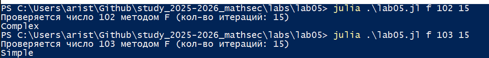

---
## Front matter
lang: ru-RU
title: Презентация к лабораторной работе 5
subtitle: Математические основы защиты информации и информационной безопасности
author:
  - Аристова Арина Олеговна
institute:
  - Российский университет дружбы народов, Москва, Россия
date: 24 октября 2025

## i18n babel
babel-lang: russian
babel-otherlangs: english

## Formatting pdf
toc: false
toc-title: Содержание
slide_level: 2
aspectratio: 169
section-titles: true
theme: metropolis
header-includes:
 - \metroset{progressbar=frametitle,sectionpage=progressbar,numbering=fraction}
 - '\makeatletter'
 - '\beamer@ignorenonframefalse'
 - '\makeatother'
---

## Докладчик

:::::::::::::: {.columns align=center}
::: {.column width="70%"}

  * Аристова Арина Олеговна
  * студентка группы НФИмд-01-25
  * Российский университет дружбы народов
  * [1032259382@rudn.ru](mailto: 1032259382@rudn.ru)
  * <https://github.com/aoaristova>

:::
::: {.column width="30%"}


:::
::::::::::::::


## Цель работы

Изучить алгоритмы проверки чисел на простоту, реализовать их на языке Julia.

## Задание

Реализовать несколько алгоритмов:

- алгоритм Ферма

- алгоритм Миллера-Рабина

- алгоритм Соловэя-Штрассена

# Выполнение лабораторной работы

## Основной блок кода

Выбор алгоритма, проверяемое число и число итераций программа получает из вводимых аргументов.

```
method = lowercase(ARGS[1])
n = parse(Int, ARGS[2])
count = length(ARGS) > 2 ? parse(Int, ARGS[3]) : 25

println("Проверяется число $n методом $(uppercase(method)) (кол-во итераций: $count)")

result = method == "f" ? Ferma(n, count) :
        method == "s" ? SoloveiStrassen(n, count) :
        method == "m" ? MillerRabin(n) :
        error("Неизвестный метод")

println(result ? "Simple" : "Complex")
```


## Проверка работы кода

Проверяю работу кода. Алгоритм Ферма

{#fig:001 width=90%}

## Проверка работы кода

Проверяю работу кода. Алгоритм Миллера-Рабина

{#fig:002 width=90%}

## Проверка работы кода

Проверяю работу кода. Алгоритм Соловэя-Штрассена

{#fig:003 width=90%}

## Вывод

В ходе выполнения лабораторной работы мною были реализованы программные решения алгоритмы проверки чисел на простоту: алгоритма Ферма, алгоритма Соловэя-Штрассена, алгоритма Миллера-Рабина.

