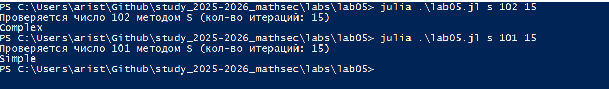

---
## Front matter
title: "Отчёт по лабораторной работе 5"
subtitle: "Вероятностные алгоритмы проверки чисел на простоту"
author: "Аристова Арина Олеговна"

## Generic otions
lang: ru-RU
toc-title: "Содержание"

## Bibliography
bibliography: bib/cite.bib
csl: pandoc/csl/gost-r-7-0-5-2008-numeric.csl

## Pdf output format
toc: true # Table of contents
toc-depth: 2
lof: true # List of figures
fontsize: 12pt
linestretch: 1.5
papersize: a4
documentclass: scrreprt
## I18n polyglossia
polyglossia-lang:
  name: russian
  options:
	- spelling=modern
	- babelshorthands=true
polyglossia-otherlangs:
  name: english
## I18n babel
babel-lang: russian
babel-otherlangs: english
## Fonts
mainfont: PT Serif
romanfont: PT Serif
sansfont: PT Sans
monofont: PT Mono
mainfontoptions: Ligatures=TeX
romanfontoptions: Ligatures=TeX
sansfontoptions: Ligatures=TeX,Scale=MatchLowercase
monofontoptions: Scale=MatchLowercase,Scale=0.9
## Biblatex
biblatex: true
biblio-style: "gost-numeric"
biblatexoptions:
  - parentracker=true
  - backend=biber
  - hyperref=auto
  - language=auto
  - autolang=other*
  - citestyle=gost-numeric
## Pandoc-crossref LaTeX customization
figureTitle: "Рис."
listingTitle: "Листинг"
lofTitle: "Список иллюстраций"
lolTitle: "Листинги"
## Misc options
indent: true
header-includes:
  - \usepackage{indentfirst}
  - \usepackage{float} # keep figures where there are in the text
  - \floatplacement{figure}{H} # keep figures where there are in the text
---


# Цель работы

Изучить алгоритмы проверки чисел на простоту, реализовать их на языке Julia.

# Задание

Реализовать несколько алгоритмов:

- алгоритм Ферма

- алгоритм Миллера-Рабина

- алгоритм Соловэя-Штрассена

# Выполнение лабораторной работы

## Код реализации алгоритмов

Выбор алгоритма, проверяемое число и число итераций программа получает из вводимых аргументов.


```
using Random

function modulo(base, exponent, mod)
    x = 1
    y = base % mod
    while exponent > 0
        if exponent % 2 == 1
            x = (x*y) % mod
        end 
        y = (y*y) % mod
        exponent //= 2
    end
    return x % mod
end


function Ferma(n, count)
    for _ in 1:count
        a = rand(2:n-1)
        if powermod(a, n-1, n) != 1
            return false
        end 
    end 
    return true
end


function CalculateJacobian(a, n)
    if a == 0
        return 0
    end
    ans = 1
    if a < 0
        a = -a
        if n % 4 == 3
            ans = -ans
        end
    end
    if a == 1
        return ans
    end
    while a != 0
        if a < 0
            a = -a
            if n % 4 == 3
                ans = -ans
            end
        end
        while a % 2 == 0
            a //=2 
            if n % 8 == 3 || n % 8 == 5
                ans = -ans
            end
        end 
        a, n = n, a 
        if a % 4 == 3 && n % 4 == 3
            ans = - ans
        end 
        a = a%n
        if a > n //2 
            a -= n
        end 
    end
    return n == 1 ? ans : 0
end


function SoloveiStrassen(p, iterations)
    if p < 2 || (p != 2 && p % 2 == 0)
        return false
    end
    for _ in 1:iterations
        a = rand(1:p-1)
        jacobian = (p + CalculateJacobian(a, p)) % 2
        mod = modulo(a, (p-1)//2, p)
        if jacobian == 0 || mod != jacobian 
            return false
        end
    end
    return true
end


function MillerRabin(n)
    if n in (0, 1, 4, 6, 8, 9)
        return false
    elseif n in (2, 3, 5, 7)
        return true
    end
    s = 0
    d = n-1
    while d % 2 == 0
        d >>= 1
        s += 1
    end
    function trial(a)
    if powermod(a, d, n) == n - 1
        return false
    end
    for i in 0:s-1
        if powermod(a, (1<<i)*d, n) == n-1
            return false
        end 
    end
    return true
end
    for _ in 1:8
        a = rand(2:n-1)
        if trial(a)
            return false
        end 
    end
    return true
end 

method = lowercase(ARGS[1])
n = parse(Int, ARGS[2])
count = length(ARGS) > 2 ? parse(Int, ARGS[3]) : 25

println("Проверяется число $n методом $(uppercase(method)) (кол-во итераций: $count)")

result = method == "f" ? Ferma(n, count) :
        method == "s" ? SoloveiStrassen(n, count) :
        method == "m" ? MillerRabin(n) :
        error("Неизвестный метод")

println(result ? "Simple" : "Complex")
```

## Проверка работы кода

Проверяю работу кода. Алгоритм Ферма

{#fig:001 width=90%}

Проверяю работу кода. Алгоритм Миллера-Рабина

{#fig:002 width=90%}

Проверяю работу кода. Алгоритм Соловэя-Штрассена

{#fig:003 width=90%}

## Вывод

В ходе выполнения лабораторной работы мною были реализованы программные решения алгоритмы проверки чисел на простоту: алгоритма Ферма, алгоритма Соловэя-Штрассена, алгоритма Миллера-Рабина.

# Список литературы{.unnumbered}

- Описание лабораторной работы 
