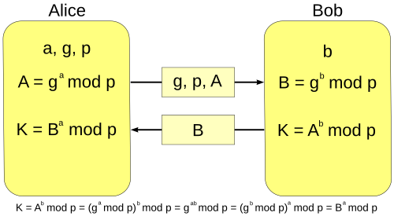

---
## Front matter
lang: ru-RU
title: Презентация к лабораторной работе 4
subtitle: Протокол Диффи–Хеллмана для обмена ключами по открытому каналу связи. Аналог, использующий группу общего вида
author:
  - Аристова Арина Олеговна
institute:
  - Российский университет дружбы народов имени Патриса Лумумбы, Москва, Россия
date: 05 декабря 2025

## i18n babel
babel-lang: russian
babel-otherlangs: english

## Formatting pdf
toc: false
toc-title: Содержание
slide_level: 2
aspectratio: 169
section-titles: true
theme: metropolis
header-includes:
 - \metroset{progressbar=frametitle,sectionpage=progressbar,numbering=fraction}
 - '\makeatletter'
 - '\beamer@ignorenonframefalse'
 - '\makeatother'
---

## Докладчик

:::::::::::::: {.columns align=center}
::: {.column width="70%"}

  * Аристова Арина Олеговна
  * студентка группы НФИмд-01-25
  * Российский университет дружбы народов имени Патриса Лумумбы
  * [1032259382@rudn.ru](mailto: 1032259382@rudn.ru)
  * <https://github.com/aoaristova>

:::
::: {.column width="30%"}

:::
::::::::::::::

## Актуальность

**Почему проблема важна:**

- Современные сети являются открытыми для перехвата.

- Секретный ключ нельзя передать напрямую по открытому каналу.

- До 1976 года не существовало практического решения задачи согласования ключей.

**Цель**: безопасно сформировать общий секретный ключ между двумя сторонами в условиях полностью наблюдаемого канала.

## Исторический контекст

**1976 год — прорыв в криптографии:**

- У. Диффи и М. Хеллман публикуют концепцию криптографии с открытым ключом.

- Предлагается первый практический алгоритм согласования ключей.

- Появляется возможность защищённого каналообмена без предварительного общего секрета.

##  Математическая основа 

**Основные элементы классического DH**:

- Простое число $p$

- Генератор мультипликативной группы $g$

- Операция: возведение в степень по модулю $p$

- Односторонняя функция: $g^{a} \bmod p$ трудно обратить (дискретный логарифм).

- Ключевое свойство: $g^{ab} \bmod p$.

## Схема работы протокола

1. Общие параметры: $p$, $g$

2. Первая сторона выбирает секрет $a$ и вычисляет $A = g^{a} \bmod p$

3. Вторая сторона выбирает секрет $b$ и вычисляет $B = g^{b} \bmod p$

4. Обмен: $A \leftrightarrow B$

5. Общий ключ: 

    - Первая сторона: $K = B^{a} = g^{ab} \bmod p$

    - Вторая сторона: $K = A^{b} = g^{ab} \bmod p$

**Результат:** общий секретный ключ ни разу не передается по сети.

## Схема работы протокола

{#fig:001 width=70% height=70%}

## Безопасность и ограничения

**Стойкость основана на**:

- Сложности дискретного логарифмирования.

- Неэффективности вычисления $a$ по $g$ и $g^{a}$

**Уязвимость**:

- Протокол не обеспечивает аутентификации.

- Возможна атака «человек посередине» (MITM).

**Решение**: использование цифровых подписей и сертификатов.

## Применение протокола 

DH используется в:

- TLS, HTTPS (включая DHE, ECDHE).

- IPsec.

- Защищённых мессенджерах (Signal, WhatsApp).

- Системах генерации симметричных ключей.

**Преимущество**: отсутствие необходимости предварительного обмена секретами.

## Обобщение на группы общего вида 

**Общая идея**:

- Операция возведения в степень заменяется повторным применением групповой операции.

- Протокол сохраняет структуру, если выполнено свойство: $(g^{a})^{b} = (g^{b})^{a}$

**Требования**:

- Эффективность прямой операции.

- Трудность обратной задачи.

**Пример**: использование произвольной абелевой группы.

## Заключение

- Протокол Диффи–Хеллмана является фундаментальным механизмом формирования общего ключа.

- Его стойкость основана на вычислительной трудности дискретного логарифма.

- Обобщение на группы общего вида расширяет область применения и повышает эффективность.

- Эллиптические кривые являются основным современным вариантом протокола.

- Новые структуры исследуются в рамках постквантовой криптографии.